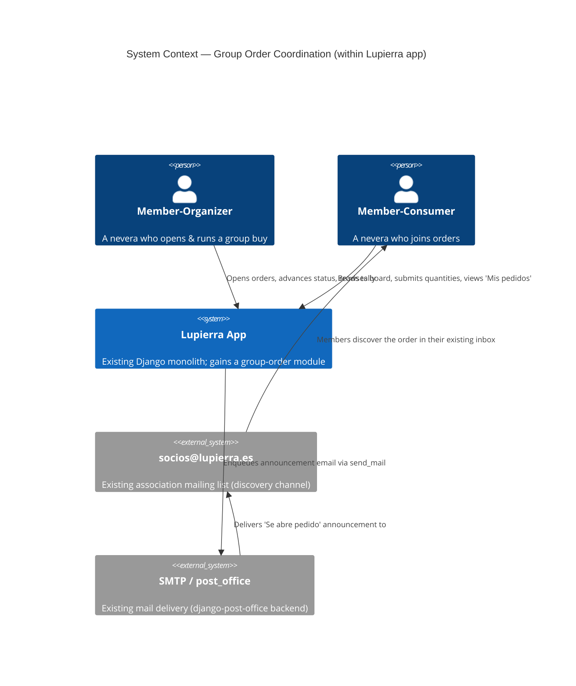
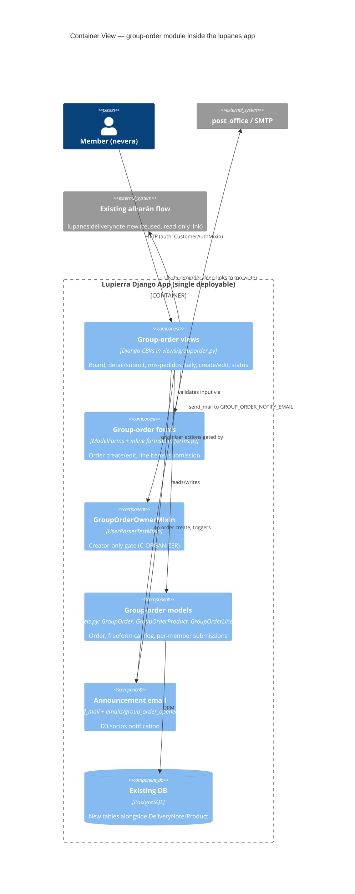
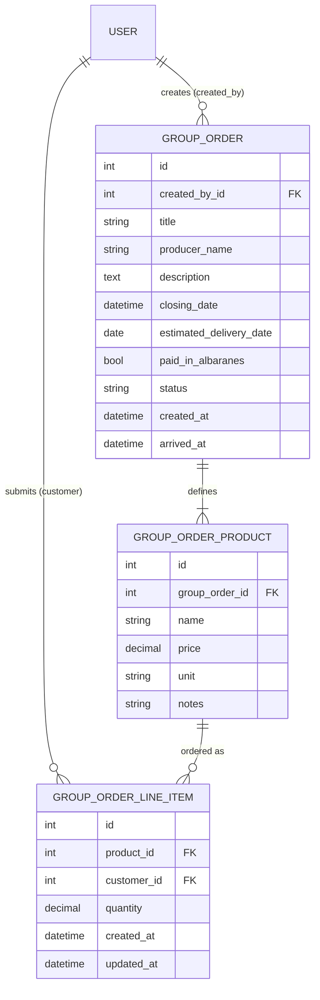
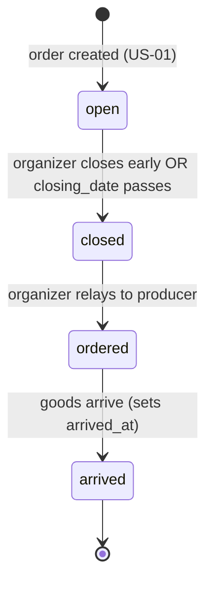
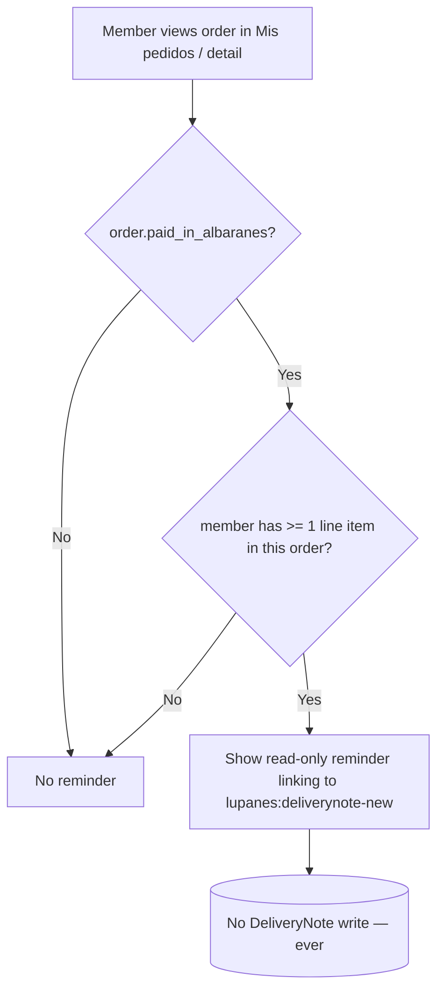

# Architecture — Group Order Coordination (v1, Pattern A)

**Feature**: group-order-coordination
**Wave**: DESIGN
**Mode**: Propose (autonomous)
**Architect**: Morgan (nw-solution-architect)
**Date**: 2026-06-16
**Status**: Proposed
**Binding inputs**: `discuss/user-stories.md` (US-01..US-08), `discuss/acceptance-criteria.md`, `discover/wave-decisions.md` (D1–D13)

> This is a **single new module inside the existing `lupanes` Django app**. The design's first
> obligation is to fit the app's established conventions, not to invent a new architecture. There is
> no microservice, no service layer, no event bus, no CQRS. One volunteer engineer, ~20-member
> association (C1, C4). The "architecture" here is: a few models, class-based views grouped by
> concern, ModelForms, Bootstrap-5 templates, one templated email.

---

## 1. System Context and Capabilities

The existing **Lupierra app** ("Albaranes Lupierra") is a Django 4.2 monolith serving a closed user
base of association members ("neveras") via the `neveras` group, and store managers via the `tienda`
group. It already owns: `DeliveryNote` (albarán) registration, `Product`/`ProductPrice` catalog,
nevera balances (pulled from Google Sheets), and a templated-email facility.

This feature adds a **group-order coordination module** that lets any member open a time-boxed group
buy, lets members submit quantities, auto-tallies them for the organizer, announces the order to the
`socios@lupierra.es` list, and tracks an order through `open → closed → ordered → arrived`.

It deliberately does **not** touch charging. It never writes a `DeliveryNote` (D13/C-NOCHARGE); the
only link to the albarán world is a read-only reminder that deep-links to the existing
`lupanes:deliverynote-new` flow.

### Quality attributes that drove the design (ISO 25010 framing)

Ranked by what the evidence and constraints actually demand — not by pattern fashion:

| Rank | Attribute | Why it matters here | Design response |
|------|-----------|---------------------|-----------------|
| 1 | **Maintainability / simplicity** | One volunteer engineer (C1). Every line is future maintenance debt. | Reuse existing patterns verbatim (CBVs, mixins, ModelForms, `send_mail`). No new abstractions. |
| 2 | **Functional correctness** | The tally (O2) and "update replaces" (US-03) are the core value; a wrong tally destroys trust. | Computed tally (single source of truth), `unique_together` on submissions, forward-only status guard. |
| 3 | **Reliability of discovery** | D3 email is a HARD requirement; without it the tool is worse than Gmail (R2). | Email-on-open that never rolls back order creation on SMTP failure. |
| 4 | **Testability** | Outside-In TDD in DELIVER needs observable behaviour, not internal hooks. | Behaviour reachable through views; email observable via test backend (see §8). |
| 5 | **Security / authorization** | Organizer-only actions must be creator-gated, NOT manager-gated (C-ORGANIZER). | `GroupOrderOwnerMixin` checking `created_by == request.user` + `is_customer`. |

Performance/scalability are explicit **non-goals**: ~20 members, a handful of open orders, a tally
over tens of rows. No caching, no pagination, no indexing strategy beyond default FKs is warranted.
Designing for scale here would be resume-driven over-engineering against C4.

---

## 2. C4 Sketch

### Level 1 — System Context



### Level 2 — Container / Module (inside the one Django container)



No Level 3 (Component) diagram is warranted: the module has 3 models and a handful of views, well
under the 5+-component threshold that would justify it.

---

## 3. Data Model

Three new models in `lupanes/models.py`. All names/fields below are the **proposed concrete shape**;
deviations from the brief's suggested shape are called out in §11.

### 3.1 `GroupOrder` — the order itself

| Field | Type | Notes |
|-------|------|-------|
| `created_by` | `FK(settings.AUTH_USER_MODEL, on_delete=PROTECT)` | The organizer. PROTECT mirrors `DeliveryNote.customer`. `related_name="group_orders"`. |
| `title` | `CharField(max_length=255)` | e.g. "Pan semana del 2 de junio". |
| `producer_name` | `CharField(max_length=255)` | Freeform (D4/D7, single producer). NOT a FK to `Producer`. |
| `description` | `TextField(blank=True)` | Optional organizer notes. |
| `closing_date` | `DateTimeField` | Submission window end. Uses existing `DateTimeLocalField` widget in the form. |
| `estimated_delivery_date` | `DateField(null=True, blank=True)` | Expected delivery (date only, like the email evidence). |
| `paid_in_albaranes` | `BooleanField(default=False)` | D13 self-service flag. Label: "El pago lo registra cada socio en albaranes". |
| `status` | `CharField(max_length=16, choices=Status.choices, default=Status.OPEN)` | See §5. |
| `created_at` | `DateTimeField(auto_now_add=True)` | Convention match with `DeliveryNote`. |
| `arrived_at` | `DateTimeField(null=True, blank=True)` | Set when status advances to `arrived`; used by US-04 "most recent arrived" ordering. |

Helper methods (computed, no stored state):

- `is_open()` → `self.status == Status.OPEN` (the single submission gate — used by US-03/US-08).
- `tally()` → returns the per-member-per-product structure for US-06 (see §4). Pure read.
- `__str__` → `f"{self.title} ({self.producer_name})"`.

> **No `Producer` FK, no `Product` FK** anywhere in this module. That is the central D4/D7 commitment.

### 3.2 `GroupOrderProduct` — the freeform line-item catalog of ONE order

The orderable items the organizer defines when opening the order. These are the columns of the tally.

| Field | Type | Notes |
|-------|------|-------|
| `group_order` | `FK(GroupOrder, on_delete=CASCADE, related_name="products")` | Items die with the order. |
| `name` | `CharField(max_length=255)` | Required. e.g. "Pan de espelta 1kg". |
| `price` | `DecimalField(max_digits=8, decimal_places=2, null=True, blank=True)` | Optional (US-01 edge case: no price yet). |
| `unit` | `CharField(max_length=32, blank=True, default="")` | Optional freeform unit ("cajas", "rollos sueltos" — D8). |
| `notes` | `CharField(max_length=255, blank=True, default="")` | Optional. |

`__str__` → `f"{self.name}"`. Ordering: by `pk` (insertion order preserves the organizer's list).

### 3.3 `GroupOrderLineItem` — one member's quantity for one product (a "submission line")

| Field | Type | Notes |
|-------|------|-------|
| `product` | `FK(GroupOrderProduct, on_delete=CASCADE, related_name="line_items")` | Which item. |
| `customer` | `FK(settings.AUTH_USER_MODEL, on_delete=PROTECT, related_name="group_order_line_items")` | The nevera who ordered. PROTECT matches `DeliveryNote.customer`. |
| `quantity` | `DecimalField(max_digits=8, decimal_places=2)` | Matches the freeform-unit world; allows halves ("media caja"). |
| `created_at` | `DateTimeField(auto_now_add=True)` | |
| `updated_at` | `DateTimeField(auto_now=True)` | Supports "update replaces" semantics. |

**`Meta.unique_together = ("product", "customer")`** — this is the structural guarantee behind
US-03's "the latest values replace the previous ones (no double counting)". A member has at most one
line per product; resubmission is an upsert keyed on `(product, customer)`, not an insert.

> Quantity `0` (or simply not submitting a product) means "I don't want this item". The submission
> form (§6) creates/updates lines only for products the member actually wants and deletes lines that
> drop to 0, keeping the tally clean. (DELIVER decides the exact upsert mechanics — the contract is
> only the unique_together + "latest replaces".)

### 3.4 Relationship diagram



Migration: this is `lupanes/migrations/0004_grouporder_...` (latest is 0003). No changes to existing
tables — purely additive (satisfies C2).

---

## 4. The Tally (US-06) — Computed, Read-Only

The tally is **derived state, never stored** (consistency requirement: US-06 AC "reflects the same
submitted data shown in Mis pedidos — single source", and the cross-cutting `@property` scenario).
Both "Mis pedidos" and the tally read from the same `GroupOrderLineItem` rows; there is no
denormalized copy that could drift.

`GroupOrder.tally()` produces, conceptually:

- the ordered list of `GroupOrderProduct` (table columns),
- per participating member, a row of quantities (0 where the member didn't order that product),
- a per-product totals row.

Implementation note for DELIVER (not prescriptive on internals): a single
`GroupOrderLineItem.objects.filter(product__group_order=self).select_related("product","customer")`
plus an in-Python pivot is more than adequate at this scale. Per-product totals are a
`.values("product").annotate(Sum("quantity"))` or a Python sum — either is fine. The view renders it
as an HTML table laid out for copy-paste into the producer email (US-06 AC). **No CSV export, no
"send to producer" button in v1** — copy-paste is the validated need; anything more is scope creep.

---

## 5. Status Lifecycle (US-08)



```python
class Status(models.TextChoices):
    OPEN = "open", "Abierto"
    CLOSED = "closed", "Cerrado"
    ORDERED = "ordered", "Pedido al productor"
    ARRIVED = "arrived", "Recibido"
```

**Transition rules (forward-only, US-08 AC + Error/Boundary):**

- Allowed transitions are exactly the four forward edges above. The order is a strict linear chain;
  `OPEN(0) → CLOSED(1) → ORDERED(2) → ARRIVED(3)`.
- A status change is accepted only if the target rank is **strictly greater** than the current rank.
  Any backward or same-rank request is rejected (US-08 "Status only moves forward"). The model
  exposes a guard (e.g. `can_advance_to(target)`); the view enforces it and the form/queryset only
  offers forward targets. The exact home (model `clean()` vs. view check) is a DELIVER detail — the
  **contract** is: backward transitions are impossible through any path.
- Advancing to `ARRIVED` stamps `arrived_at = timezone.now()`.

**Auto-close (US-08 Technical Note, C1 — no manual chore):** orders past `closing_date` are treated
as closed. Two acceptable mechanisms, decision deferred to DELIVER but the design supports either:
  1. **Lazy/derived close** — the board queryset and the submission gate test
     `status == OPEN AND closing_date > now()`, so a stale `open` row past its date neither lists on
     the board nor accepts submissions, even before any sweep runs. This needs **no cron** and is the
     C1-cheapest option.
  2. **Management command** (`close_expired_group_orders`) run by the existing scheduler to flip the
     stored status, if a persisted `closed` value is wanted for display.

Recommendation: ship **lazy/derived close** (option 1) as the source of truth for the submission gate
and board filter (zero ops cost, C1), optionally adding the management command later only if the
stored status visibly matters. This keeps US-02 Edge Case (closed order drops off board) and US-03
Error/Boundary (submission blocked) correct without a scheduler dependency.

**Authorization:** only `created_by` can advance status (US-08 AC, C-ORGANIZER) — see §7.

---

## 6. Component Boundaries — Forms

All in `lupanes/forms.py`, following the existing `ModelForm` + `__init__` pop-kwarg + overridden
`save()` pattern already used by `DeliveryNoteCreateForm` / `DeliveryNoteForm`.

| Form | Purpose | Story | Shape |
|------|---------|-------|-------|
| `GroupOrderForm` | Create/edit the order header | US-01, US-08 | `ModelForm` on `GroupOrder`, fields = `title, producer_name, description, closing_date, estimated_delivery_date, paid_in_albaranes`. `closing_date` uses the existing `DateTimeLocalField`. `created_by` set from `request.user` in `save()` (mirrors `DeliveryNoteForm.save`). |
| `GroupOrderProductFormSet` | The ≥1 freeform line items at creation | US-01 | `inlineformset_factory(GroupOrder, GroupOrderProduct, ...)` with `min_num=1, validate_min=True, extra=3`. The `validate_min` enforces US-01's "cannot create with zero line items" with a Spanish error message ("Un pedido necesita al menos un producto"). |
| `GroupOrderSubmissionForm` | A member's quantities against an open order | US-03 | Built dynamically: one optional `DecimalField` per `GroupOrderProduct` of the order. On `save()`, upserts `GroupOrderLineItem` per `(product, request.user)` keyed on `unique_together`; deletes lines set to blank/0. Validates `order.is_open()` and raises a Spanish "El pedido está cerrado" error otherwise (US-03 Error/Boundary). |

> A dynamic per-product form (rather than a submission formset) is the simplest fit because the set of
> products is fixed per order and the member just types quantities next to a known list. DELIVER may
> implement it as a plain `Form` with generated fields or a small formset — the AC don't constrain
> the mechanism, only the "latest replaces, blocked when closed" behaviour.

---

## 7. Authorization

Three tiers, all piggybacking on existing auth (C-AUTH, C3 — no new signup):

1. **All views require an authenticated customer.** Reuse the existing
   `lupanes.users.mixins.CustomerAuthMixin` (already `is_authenticated AND is_customer`). No change.

2. **Organizer-only actions** (edit order, advance status, set the albarán flag, view tally) are gated
   by *creator identity*, NOT the `tienda` manager group (C-ORGANIZER, US-06/US-08 AC, cross-cutting
   `@property` scenario "holds regardless of whether that member is in the manager group").

   **Proposed reusable mixin** (new, in `lupanes/users/mixins.py` alongside the existing two):

   ```python
   class GroupOrderOwnerMixin(CustomerAuthMixin):
       """Creator-only gate for group-order organizer actions (C-ORGANIZER).
       Deliberately ignores the 'tienda' manager group."""
       def test_func(self):
           if not super().test_func():          # authenticated customer
               return False
           order = self.get_object()             # the GroupOrder (or its parent)
           return order.created_by_id == self.request.user.pk
   ```

   This composes with `CustomerAuthMixin` (inherits its `test_func` via `super()`), so the customer
   check and the ownership check live in one place and stay consistent. Views whose `get_object()`
   isn't the `GroupOrder` itself (e.g. the tally on the detail page) resolve the order explicitly.

3. **Tally visibility is creator-only inside an otherwise-shared detail page** (Open Q2 → tally section
   on the order page, visible only to that order's organizer; US-06 Error/Boundary). Because the order
   **detail/submit page is shared** by all members (consumers submit there), the page itself uses
   `CustomerAuthMixin`, and the **tally section is conditionally rendered** when
   `request.user == order.created_by`. The view computes `tally()` only for the creator; the template
   guards the section. Non-creators never receive the tally data in context (defense in depth, not
   just CSS-hidden).

> Why no manager path at all: D13/C-ORGANIZER are explicit that organizing is creator-scoped, not a
> store-management capability. A manager who didn't create the order has no organizer rights over it.
> The `tienda` group keeps its existing albarán powers untouched; it simply has no role in this module.

---

## 8. Email on Open (US-07 / D3) — Design and Testability

### Trigger and recipient

- Triggered **once, on successful order creation** (in `GroupOrderCreateView.form_valid`, after the
  order + its products are saved). Not on edit, not on status change (D3 is open-only).
- Recipient is a **single configured list address**, NOT per-member transactional sends (US-07 AC
  "via the existing socios list"). This preserves members' existing Gmail filters (C5/IA3).

### New setting (none exists today)

Add to `proj/settings.py`, django-environ style, **defaulting sensibly so tests need no env**:

```python
# Recipient list for group-order announcements (D3). Single list address, not per-member.
GROUP_ORDER_NOTIFY_EMAIL = env(
    "GROUP_ORDER_NOTIFY_EMAIL",
    default="socios@lupierra.es",
)
```

Sender is the existing `settings.DEFAULT_FROM_EMAIL`. Subject mirrors the association voice
("Se abre pedido: {title}").

### Content (US-07 AC + edge case)

Templated text email at `lupanes/templates/emails/group_order_opened.txt`, rendered with
`render_to_string` exactly like the existing `emails/missing_product.txt`. Must contain: title,
producer name, the line items (**price omitted where `price is None`** — US-07 edge case), closing
date, and an **absolute link to the order page** (`request.build_absolute_uri(reverse(...))`). A
matching `.html` part is optional and out of scope for v1 (text is enough; matches existing style).

### Failure isolation (US-07 Error/Boundary — the critical correctness point)

The order MUST persist even if mail fails. Pattern:

```python
def form_valid(self, form):
    response = super().form_valid(form)   # order + products committed first
    try:
        self._send_announcement(self.object)
        messages.success(self.request, "Pedido abierto y anuncio enviado a los socios.")
    except Exception:
        logger.exception("Group-order announcement email failed for order %s", self.object.pk)
        messages.warning(
            self.request,
            "El pedido se ha abierto, pero el aviso a los socios puede no haberse enviado.",
        )
    return response
```

i.e. **send after commit, catch broadly, log, degrade the message** — never let a mail exception
bubble up and 500 the create (or worse, roll it back). This directly satisfies US-07's third scenario.
`send_mail(..., fail_silently=False)` so failures are catchable (the existing code uses
`fail_silently=False` too).

### Testability — IMPORTANT app-specific finding

The app's default `EMAIL_BACKEND` is **`post_office.EmailBackend`** (django-post-office), which
*enqueues* mail rather than delivering synchronously — so `django.core.mail.outbox` is **not**
automatically populated the way it is with the locmem backend. Two clean options for DELIVER tests,
both standard:

1. **Override to locmem in tests** (recommended, simplest):
   ```python
   @override_settings(EMAIL_BACKEND="django.core.mail.backends.locmem.EmailBackend")
   class GroupOrderEmailTests(TestCase): ...
   # then assert len(mail.outbox) == 1 and recipients/subject/body
   ```
   This is the cleanest way to assert the D3 contract (recipient = `GROUP_ORDER_NOTIFY_EMAIL`,
   body contains title/producer/items/closing/link) and the "items without price" edge case.

2. **Assert on the post_office queue** (`post_office.models.Email`) if you want to test the real
   backend's enqueue behaviour. Heavier; only needed if queue semantics are themselves under test.

For the **failure scenario** (US-07 third), patch the send to raise and assert: order still exists
with `status="open"`, a warning message is present, and the exception was logged
(`with self.assertLogs("lupanes", level="ERROR")`).

### Contract-testing annotation (external boundary)

The SMTP/`socios@lupierra.es` mail path is the one external integration in this feature. It is a
**fire-and-forget notification with graceful degradation**, not a request/response API contract, so a
consumer-driven contract test (Pact et al.) is **not warranted** — there is no schema the provider
could break that would silently corrupt behaviour; the failure path is already explicitly handled and
tested. The platform-architect handoff records this as "external integration: email notification,
degradation-tested, no contract test required."

---

## 9. The Albarán Reminder (US-05 / D13) — Pure Template Conditional, No Writes

- **Render location:** on the surfaces where a member sees their own participation — the **"Mis
  pedidos"** view (US-04) and the **order detail** view. (US-05 says "Mis pedidos / the order detail".)
- **Trigger condition (exact):** `order.paid_in_albaranes is True` **AND** the viewing member has
  ≥1 `GroupOrderLineItem` in that order. Both must hold (US-05 AC + all three scenarios). Computed in
  the view/context; no stored flag on the member.
- **Content:** read-only Bootstrap alert, Spanish, association voice:
  "Recuerda apuntar lo que cojas en tu albarán", with a link to the **existing**
  `lupanes:deliverynote-new`. No prefilled data, no FK, no write.
- **Hard guarantee (US-05 AC #4 + scenario 4):** the module contains **no code path that creates or
  modifies a `DeliveryNote`**. This is enforced by simple absence — the reminder is a `<a href>` to an
  existing URL. The test (§8/§10) asserts `DeliveryNote.objects.count()` is unchanged after viewing
  the reminder.



---

## 10. View / URL Inventory

All views are **class-based**, live in a new `lupanes/views/grouporder.py`, are re-exported from
`lupanes/views/__init__.py` (matching the existing split-by-concern layout), and use URL names of the
shape `lupanes:grouporder-*` (C-CONVENTION). Templates extend `lupanes/base.html`.

| # | URL pattern | name | View (CBV base) | Auth | Story |
|---|-------------|------|-----------------|------|-------|
| 1 | `pedidos/` | `lupanes:grouporder-list` | `GroupOrderListView` (`ListView`) | `CustomerAuthMixin` | US-02 (board: open orders only) |
| 2 | `pedidos/nuevo/` | `lupanes:grouporder-new` | `GroupOrderCreateView` (`CreateView`) | `CustomerAuthMixin` | US-01, US-07 (sends email), US-08 (sets `open`) |
| 3 | `pedidos/<int:pk>/` | `lupanes:grouporder-detail` | `GroupOrderDetailView` (`DetailView`) | `CustomerAuthMixin` | US-03 surface, US-05 reminder, US-06 tally (creator-only section) |
| 4 | `pedidos/<int:pk>/editar/` | `lupanes:grouporder-edit` | `GroupOrderUpdateView` (`UpdateView`) | `GroupOrderOwnerMixin` | US-01 edit, US-08 flag |
| 5 | `pedidos/<int:pk>/participar/` | `lupanes:grouporder-submit` | `GroupOrderSubmitView` (`FormView`/`UpdateView`) | `CustomerAuthMixin` (+ `order.is_open()` guard) | US-03 (submit/update quantities) |
| 6 | `pedidos/<int:pk>/estado/` | `lupanes:grouporder-status` | `GroupOrderStatusView` (`UpdateView`/`View`) | `GroupOrderOwnerMixin` (+ forward-only guard) | US-08 (advance status) |
| 7 | `mis-pedidos/` | `lupanes:grouporder-mine` | `GroupOrderMineView` (`ListView`/`TemplateView`) | `CustomerAuthMixin` | US-04 (own lines, active + most-recent-arrived), US-05 reminder |

Notes:
- **#3 and #5 can be merged** into a single detail-with-submit page (the brief's "detail/submit
  page"). Kept as distinct rows for clarity; DELIVER may collapse #5's POST into #3. Either way the
  submit POST is gated on `is_open()`.
- **#6 (tally)** is NOT a separate URL — per Open Q2 it is a **section of #3** rendered only to the
  creator. There is intentionally no `grouporder-tally` URL.
- **"Active" for US-04** = `status == open` (currently open) **plus** the member's single most-recent
  `arrived` order (by `arrived_at`). Older `arrived` orders and full history are vNext (D2). The
  queryset: member's line items where the order is open, unioned with the member's line items in the
  one order with the greatest `arrived_at`.
- **Navigation:** add "Pedidos" and "Mis pedidos" links to the customer block of
  `lupanes/templates/lupanes/base.html` (the existing `` nav list).

### Template inventory (under `lupanes/templates/lupanes/`)

| Template | Used by | Empty state |
|----------|---------|-------------|
| `grouporder_list.html` | board (#1) | "No hay pedidos abiertos ahora mismo" (US-02) |
| `grouporder_form.html` | create/edit (#2, #4) | n/a (validation: "≥1 producto") |
| `grouporder_detail.html` | detail/submit + tally + reminder (#3) | tally hidden for non-creators |
| `grouporder_mine.html` | Mis pedidos (#6) | "Aún no has participado… mira el tablón" (US-04) |
| `emails/group_order_opened.txt` | US-07 announcement | n/a |

---

## 11. Deviations from the Brief's Proposed Shape (with rationale)

The brief asked me to confirm/adjust. The model shape is **adopted essentially as proposed**. The
deviations are minor and justified:

1. **`GroupOrderLineItem.product` FK target is `GroupOrderProduct`, not `GroupOrderProduct`+order
   redundantly.** The brief said `unique_together (product, customer)`; I keep exactly that. The order
   is reached via `product.group_order`, so there is **no `group_order` FK on the line item** (it would
   be a denormalized duplicate that can drift). Tally/Mis-pedidos query through
   `product__group_order`. *Rationale: normalization + single source of truth (US-06 consistency).*

2. **Dropped `paid_in_albaranes`/extra timestamps? No — kept all.** I retained `arrived_at` (the brief
   marked it nullable) and use it as the ordering key for US-04's "most recent arrived". `created_at`
   kept on all three models for convention parity with `DeliveryNote`.

3. **`price` precision = `DecimalField(max_digits=8, decimal_places=2)`** (brief said "Decimal
   nullable"). I pinned precision to 2 decimals / 8 digits to match money handling, distinct from the
   existing `ProductPrice` (5,2) only in headroom. *Rationale: explicit money precision; freeform but
   still a price.* `quantity` uses `(8,2)` to allow "media caja" halves (the existing `DeliveryNote`
   uses `(6,3)` for kg fractions — group orders are coarser units, so 2 decimals suffices and D2 defers
   fractional-unit modelling).

4. **No stored `is_closed`/computed status duplication; auto-close is lazy/derived (§5).** The brief
   allowed "auto-close when closing_date passes is acceptable." I recommend the **derived** approach as
   primary (no cron, C1-cheapest) rather than a mandatory scheduled job. *Rationale: zero ops burden
   for a volunteer engineer.*

5. **Tally is not its own URL/view** — it is a creator-only section of the detail page (Open Q2
   recommendation). *Rationale: matches the resolved open question; fewer surfaces to secure.*

6. **`GROUP_ORDER_NOTIFY_EMAIL`** is the proposed setting name (brief floated this exact name);
   defaulted to `socios@lupierra.es` so tests and dev need no env. Adopted as-is.

7. **New `GroupOrderOwnerMixin` subclasses `CustomerAuthMixin`** (rather than standing alone) so the
   "authenticated customer" and "is creator" checks compose in one place. *Rationale: DRY + the
   cross-cutting `@property` guarantee that organizer actions are creator-scoped regardless of manager
   group lives in exactly one testable unit.*

Nothing in the brief's proposed shape was rejected; the above are tightening/normalization choices.

---

## 12. Test Strategy

Tests use the existing harness: `django.test.TestCase`, run via `manage.py test`. The current single
`lupanes/tests.py` is already large; **split group-order tests into a `lupanes/tests/` package**
(`tests/test_group_order_models.py`, `tests/test_group_order_views.py`,
`tests/test_group_order_email.py`) — Django discovers a `tests` package the same as `tests.py`. A
shared `setUp` creates the `neveras` group and two-three member users (Gloria, Pablo, Marta) mirroring
the existing `UserMonthlyConsumptionTestCase` setup.

These acceptance scenarios **drive Outside-In TDD in DELIVER**: each Gherkin scenario in
`acceptance-criteria.md` becomes a failing view-level test first (RED), then the model/form/view code
to satisfy it (GREEN), then refactor.

| Story | Acceptance scenarios | Test class(es) | Level | Key assertions |
|-------|----------------------|----------------|-------|----------------|
| US-01 | open bread order / no-price order / zero-line-items rejected | `GroupOrderCreateTests` | view + form | created with `status=open`, `created_by=user`; products saved w/o price; formset `validate_min` blocks 0 items with Spanish error |
| US-02 | board lists open / closed excluded / empty state | `GroupOrderBoardTests` | view | only `open` (and not-past-closing) listed; closed absent; empty-state copy present |
| US-03 | submit / update-replaces / blocked-when-closed | `GroupOrderSubmitTests` | view + model | line saved under `request.user`; resubmit updates same row (unique_together, count stable); POST on closed order rejected with "cerrado" |
| US-04 | recall across active / own-only / most-recent-arrived / empty | `GroupOrderMineTests` | view | shows only `request.user` lines; open + single most-recent arrived; older arrived absent; empty-state copy |
| US-05 | flag ON+ordered shows / flag OFF none / ON+not-ordered none / never charges | `GroupOrderReminderTests` | view + model | reminder iff `paid_in_albaranes AND member-has-line`; link to `deliverynote-new`; `DeliveryNote.objects.count()` unchanged |
| US-06 | tally table / single participant / creator-only | `GroupOrderTallyTests` | view + model | `tally()` pivot correct incl. per-product totals & 0-cells; non-creator gets no tally in context (and not in a manager bypass) |
| US-07 | announce on open / items w/o price / failed send keeps order | `GroupOrderEmailTests` (`@override_settings` locmem) | view | `mail.outbox` len 1, recipient = `GROUP_ORDER_NOTIFY_EMAIL`, body has title/producer/items/closing/link; price omitted when None; on patched-raise: order persists `open` + warning + `assertLogs ERROR` |
| US-08 | advance lifecycle / close early / creator-only / no-backward | `GroupOrderStatusTests` | view + model | forward edges succeed; backward/same rejected (status unchanged); non-creator forbidden (incl. manager); `arrived_at` set on arrive; submission blocked once not `open` |
| cross-cut | Mis-pedidos ≡ tally / organizer-only never for non-creators | `GroupOrderConsistencyTests` | view + model | every Mis-pedidos quantity equals the tally cell; tally/status/flag/edit unavailable to any non-creator incl. manager-group member |

Property-style cross-cutting tests (the two `@property` scenarios) get explicit invariant tests
rather than full property-based generation — at this scale, table-driven examples covering the
personas (Gloria/Pablo/Marta/Didier) are sufficient and match the team's existing test style.

---

## 13. Quality Gate Self-Check

- [x] Requirements traced to components — every US maps to views/models/forms in §3, §6, §10, §12.
- [x] Component boundaries with clear responsibilities — 3 models, gated views, 3 forms (§3, §6, §7).
- [x] Technology choices justified — **no new dependencies**; reuse Django CBVs, ModelForms,
      django-bootstrap5, `send_mail`/django-post-office, existing mixins (all already in the stack;
      BSD/MIT/Apache OSS already vetted by the project). One new setting, one new mixin, one email
      template. ADRs are inline-justified rather than separate files given the no-new-tech reality.
- [x] Quality attributes addressed — maintainability/correctness/reliability/testability/authz (§1).
      Performance/scale explicitly out of scope with rationale (anti-over-engineering vs C4).
- [x] Dependency direction — views depend on models/forms; models depend on nothing in the module;
      the only outward dependency is `send_mail` (isolated in `form_valid`) and a read-only URL link.
- [x] C4 diagrams — L1 + L2 present (§2); L3 intentionally omitted (under 5-component threshold).
- [x] Integration patterns — sync HTTP within the monolith; async email via existing post_office;
      read-only deep-link to existing albarán flow (§8, §9).
- [x] OSS preference — satisfied trivially (no new tech).
- [x] AC behavioural, not implementation-coupled — view-level/observable; internals left to DELIVER.
- [x] External integration annotated — email path documented; contract test deemed not warranted with
      rationale (§8).
- [x] Architectural enforcement — Python-appropriate: the "no DeliveryNote writes" rule (D13) is
      enforced by a unit test asserting `DeliveryNote` count invariance (§12 US-05); the
      creator-not-manager rule is enforced by `GroupOrderOwnerMixin` + its cross-cutting test (§7,
      §12). For ongoing module-boundary enforcement, **`import-linter`** can pin a contract that the
      group-order module must not import `DeliveryNote`/`Product` write paths — optional, low-cost,
      recommended if the module grows.
- [ ] Peer review — **intentionally skipped** per the task instruction ("Do NOT dispatch a reviewer").

---

## 14. Handoff to DELIVER

- **Build order** = release slices from `user-stories.md`: R1 walking skeleton (US-01 → US-02 → US-03
  → US-06), then R2 (US-07, US-08, US-04), then R3 (US-05).
- **Outside-In TDD**: each Gherkin scenario → failing view test → minimal code → refactor (§12).
- **Migrations**: one additive migration `0004_*` (three new tables, no edits to existing tables, C2).
- **One new setting** (`GROUP_ORDER_NOTIFY_EMAIL`), **one new mixin** (`GroupOrderOwnerMixin`), **one
  new email template** (`emails/group_order_opened.txt`), **one new views module**
  (`views/grouporder.py`), **nav links** added to `base.html`.
- **Hard gate reminder**: D9 pre-DELIVER mockup review (2/3 organizers commit) must close before
  production rollout — that is a product gate, not blocking the code design.
- **External integration (platform-architect note)**: email notification to `socios@lupierra.es` via
  existing post_office/SMTP; failure-isolated and degradation-tested; **no contract test required**
  (fire-and-forget notification, no breakable response schema).
```
